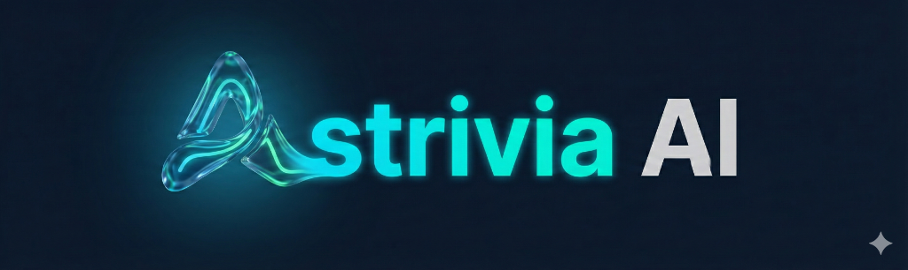
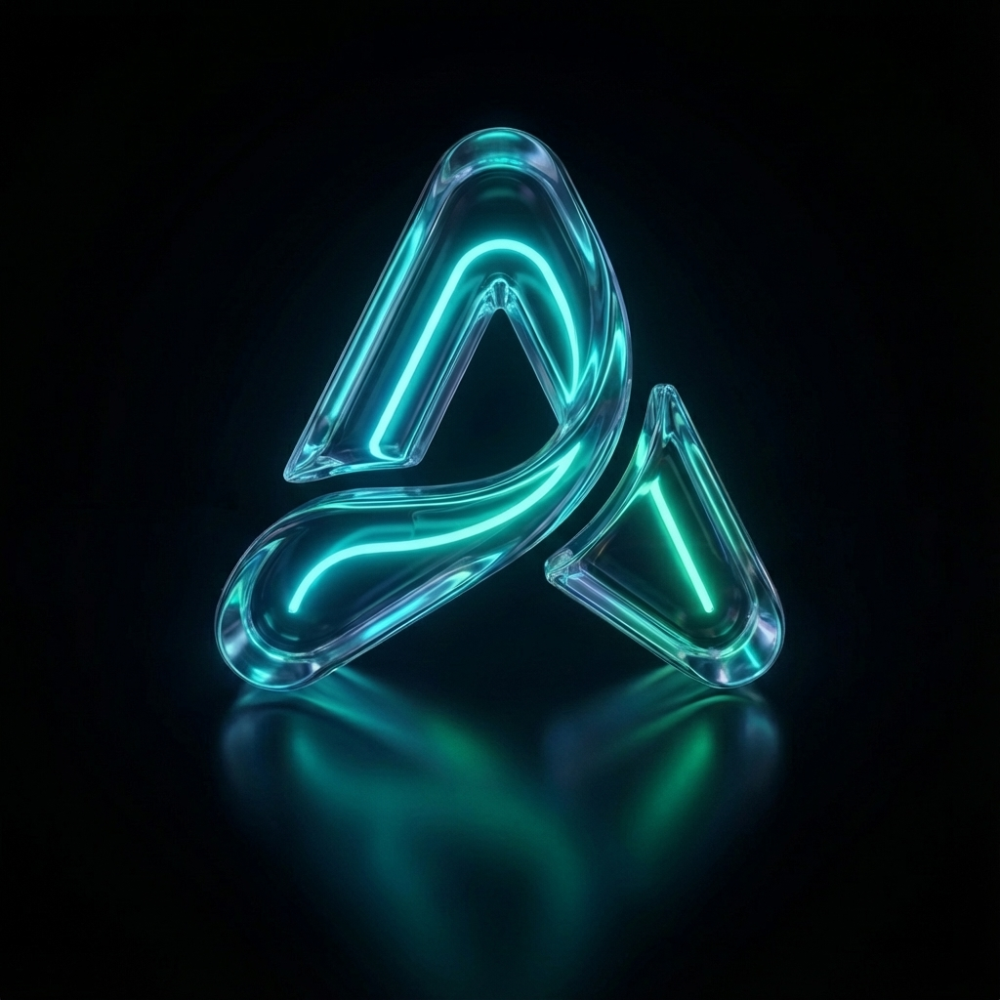
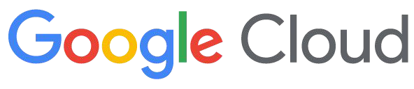

  
  <h1>Astrivia AI Brand Guide</h1>
  
<strong>Versao 1.1</strong> | Documento oficial para materiais comerciais e institucionais

  
Parte do Google for Startups Cloud Program

---

## 1. Identidade da marca

Astrivia AI e uma plataforma de agentes de IA para Life Sciences, com foco em:

- seguranca regulatoria
- rastreabilidade
- velocidade operacional com qualidade tecnica

**Posicionamento curto (recomendado):**  
`A plataforma de agentes de IA para Life Sciences.`

**Tom de voz:** claro, tecnico, confiavel, direto.

## 2. Logos oficiais

### 2.1 Arquivos aprovados

- Wordmark principal: `public/images/astrivia-logo-fixed.png`
- Versao vetorial: `public/images/astrivia-logo-hires.svg`
- Simbolo: `public/images/logo-symbol.png`

### 2.2 Previews

  
    
  

### 2.3 Regras de uso

`DO`

- manter proporcao original
- manter area de respiro ao redor do logo
- usar em fundo com contraste suficiente

`DON'T`

- distorcer horizontal/verticalmente
- aplicar glow pesado, sombra ou contorno sobre o logo
- alterar as cores oficiais do arquivo

## 3. Sistema de cores (5 cores principais)

| Papel | Hex | Uso |
|---|---|---|
| Cyan principal | `#00D9FF` | destaque de marca, links, CTAs |
| Fundo base | `#0A0A0A` | fundo principal |
| Superficie | `#141414` | cards e secoes elevadas |
| Roxo de apoio | `#A855F7` | acento secundario |
| Verde de confianca | `#10B981` | status positivo e validacao |

### 3.1 Swatches visuais

<table>
  <tr>
    <td style="background:#00D9FF;color:#00131a;padding:16px;border-radius:8px;"><strong>#00D9FF</strong> Cyan principal</td>
    <td style="background:#0A0A0A;color:#ffffff;padding:16px;border-radius:8px;"><strong>#0A0A0A</strong> Fundo base</td>
  </tr>
  <tr>
    <td style="background:#141414;color:#ffffff;padding:16px;border-radius:8px;"><strong>#141414</strong> Superficie</td>
    <td style="background:#A855F7;color:#ffffff;padding:16px;border-radius:8px;"><strong>#A855F7</strong> Roxo de apoio</td>
  </tr>
  <tr>
    <td style="background:#10B981;color:#032d20;padding:16px;border-radius:8px;"><strong>#10B981</strong> Verde de confianca</td>
    <td style="background:#ffffff;color:#0a0a0a;padding:16px;border:1px solid #e5e7eb;border-radius:8px;"><strong>Neutro</strong> Texto em fundo claro</td>
  </tr>
</table>

## 4. Tipografia e estilo visual

### 4.1 Tipografia oficial

- Titulos: `Space Grotesk` (600-700)
- Corpo: `Inter` (400-500)

### 4.2 Linguagem visual

- base escura com destaques em cyan
- interfaces com bordas suaves e leitura limpa
- evitar excesso de efeitos que reduzam legibilidade

### 4.3 Exemplo de hierarquia

- H1: titulo principal de secao/proposta
- H2: subtitulo de bloco
- Body: texto explicativo
- Label: marcadores curtos (produto, categoria, status)

## 5. Google for Startups Cloud Program

### 5.1 Atribuicao textual permitida

- `Parte do Google for Startups Cloud Program`
- `Nossa tecnologia integra com Google Cloud`
- `Fazemos parte do Google for Startups Cloud Program`

### 5.2 Texto a evitar

- `Powered by Google Cloud`

### 5.3 Uso de logo Google Cloud

- usar somente arquivo oficial, sem alteracao
- versao full-color em fundo branco (preferencial)
- sempre acompanhado de texto fiel sobre a relacao

  

## 6. Copys prontas para comunicacao

### Opcao 1

`Estamos felizes em anunciar que fomos aceitos no Google for Startups Cloud Program, com acesso a recursos para escalar nossa tecnologia com mais velocidade e seguranca no Google Cloud.`

### Opcao 2

`A Astrivia AI agora faz parte do Google for Startups Cloud Program. Alem de creditos em Google Cloud, temos acesso a tecnologia, suporte e recursos para evoluir nosso ecossistema de IA para Life Sciences.`

### Opcao 3 (AI-focused)

`Como startup de IA em Life Sciences, a Astrivia AI passa a integrar o Google for Startups Cloud Program, com beneficios tecnicos para ampliar performance, confiabilidade e escala.`

## 7. Aplicacoes recomendadas

- site institucional
- pitch deck
- one-pager comercial
- proposta para clientes enterprise
- materiais de relacao com investidores

---

## 8. Checklist de consistencia (antes de publicar)

- logo oficial correto foi usado
- cores seguem a paleta oficial
- tipografia segue padrao da marca
- texto sobre Google Cloud esta fiel e sem exagero
- legibilidade aprovada em desktop e mobile

---

Documento oficial de marca Astrivia AI.  
Para versoes futuras: atualizar este arquivo e exportar em PDF para distribuicao externa.
